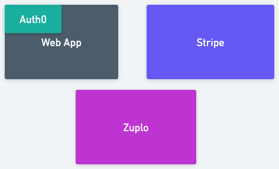
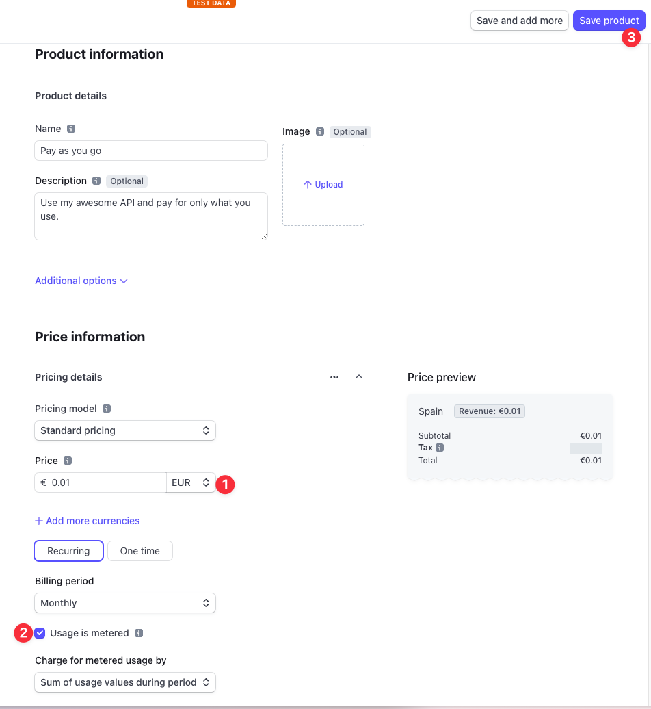
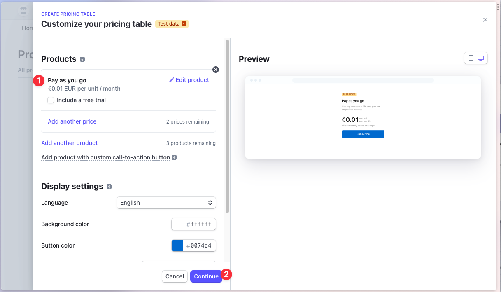
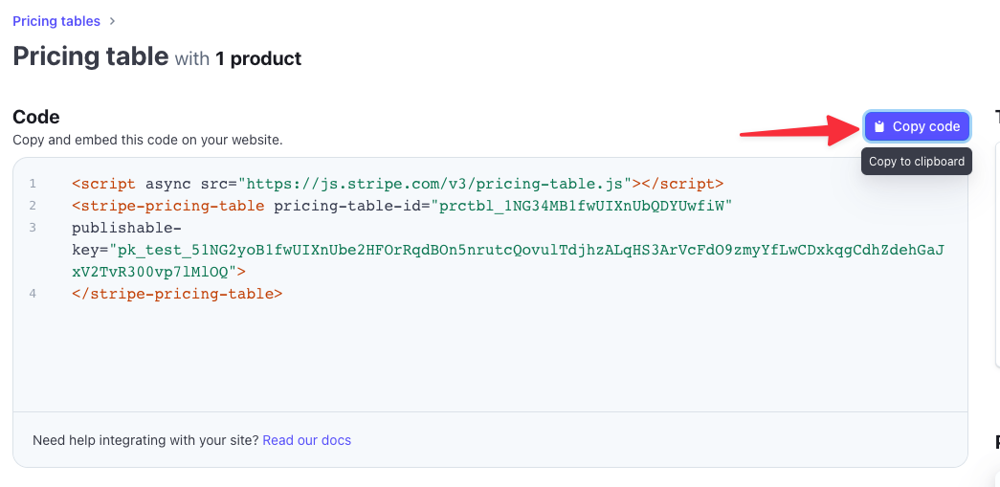

# Money API Example

This is a repository containing a sample application that shows how to monetize your APIs using Zuplo.

It uses the following technologies:

- [Zuplo](https://zuplo.com) - API Gateway
- [Stripe](https://stripe.com) - Payment Processor
- [Auth0](https://auth0.com) - Authentication Provider
- [NextJS](https://nextjs.org) - Web App Framework

## How it works

This example shows how to monetize an API using Zuplo. It uses a simple ToDo API as an example.

Zuplo is used by companies that want to ship production-ready APIs to their customers. It offers beautiful Developer Docs, API Key authentication, rate-limiting and more.

This sample application consists of 3 parts:

- A Zuplo API Gateway that secures your API and allows you to monetize it
- A simple web-app using [NextJS](https://nextjs.org) that allows users to sign up and subscribe to your API
- A Stripe subscription product that allows your users to pay for the exact number of requests they make to your API



Your customers will be able to sign up to use your API using the web-app and make requests to your API using an API Key that they can generate in the Zuplo Developer Portal.

## Getting Started

[Fork](https://github.com/zuplo/money-api-example/fork) the repository as you will need to connect Zuplo to your own repository.

### Step 1 - Create a Stripe Subscription Product

Stripe is used to manage the subscription of your users to your API. In this section, you will create a Stripe subscription product to allow your users to "pay as they go" and bill them for the exact number of requests that they made in a period of time.

Steps:

1. Log in to Stripe https://stripe.com (if you're creating a new account, you can skip the section of _Activate payments on your account_)

2. Create a subscription Product

Go to* **_Products_** and click **_Add a product_**.  

Now create a product with the following details: 



3. Create a Pricing Table to embed on the web-app

Go back to _Product_ menu and click on the _Pricing tables_. 

Fill in the details as shown below:



4. Add the Pricing table to your website

Copy the Pricing Table code which will be used in the web app: 



Paste the code in the file [`/dashboard/components/stripe-pricing-table.tsx`](./dashboard/components/stripe-pricing-table.tsx)

```diff
<div
  dangerouslySetInnerHTML={{
    __html: `
+        <script async src="https://js.stripe.com/v3/pricing-table.js"></script>
+        <stripe-pricing-table pricing-table-id="prctbl_1234ABC" publishable-key="pk_test_1234ABC">
+        </stripe-pricing-table>
      `,
  }}
/>
```

5. Hold on to your Stripe Secret Key

This Key will be used in the next step to configure the Zuplo API Gateway.

Copy the Stripe Secret Key from the top right menu **_Developers > API Keys > Copy Secret Key_**. 

### Step 2 - Deploy the API with Zuplo

This API is configured to be deployed to Zuplo. You can find the git repo
[here](https://github.com/zuplo/money-api-example), but all you have
to do is click on the deploy button below and Zuplo will automatically create a
copy of the project and deploy it for you 😎

[](http://portal.zuplo.com/zup-it?sourceRepoUrl=https://github.com/zuplo/money-api-example)

You should see the below screen. Enter a custom name for your project or accept
the default suggestion. Click **Zup It!** to complete the deployment.

> **Auth0 Demo Tenant**:
> To make it easier to get started with this demo we have provided you with a demo
> Auth0 tenant. You can easily create and configure your own Auth0 tenant by
> modifying the environment variables in the auth translation service and your
> developer console projects.

Go to **_Settings > Environment Variables_** and create the following
Environment Variables:

1. `AUTH0_AUDIENCE`: This is the value of your configured API Audience in Auth0.
   For simplicity you can use the value below from our sample Auth0 tenant to
   test.

   ```
   https://api.example.com/
   ```

1. `AUTH0_DOMAIN`: This is the value of your Auth0 domain. For simplicity, you
   can use the value below from our sample Auth0 tenant to test.

   ```
   zuplo-samples.us.auth0.com
   ```

1. `BUCKET_URL`: Get the value for this from **_Settings > Project
   Information_** tab. The value is labelled ‘_API Key Bucket URL_’.
1. `ZAPI_KEY`: (_Secret_) Get your ZAPI (Zuplo API) Key from the **_Settings >
   Zuplo API Keys_** section.
1. `STRIPE_API_KEY`: This key is the Stripe Secret Key that you got in the
   previous step.

All done! Your auth translation service is all ready to go 👏.

> E-mail verification
> To keep the demo simple, we do not check if the user's
> [e-mail is verified](https://auth0.com/docs/manage-users/user-accounts/verify-emails).
> You should do this in any real implementation.

### 3- Build the Web App

This is a sample NextJS project that will be used to allow users to sign up and
subscribe to your API.

Clone the project by running the following command. You will be asked to name your project.

```sh
npx create-next-app --example \
  https://github.com/zuplo/sample-money-api-dashboard
```

We'll now need to get the Auth Translation API url from the previous steps to
start the Developer Console.

1.  Copy the API url

    In Zuplo, Go to the **_Settings > Project Information_** tab in Zuplo and
    grab the Current Env URL value (it will look something like
    `https://sample-auth-translation-api-main-a494b6a.d2.zuplo.dev`)

2.  Set the Environment Variable

    In your web app, open the `.env.local` file and set the
    `NEXT_PUBLIC_API_URL` variable using the URL from the previous step:

    ```txt title=.env.local {1}
    NEXT_PUBLIC_API_URL=https://you-url-here.d2.zuplo.dev
    NEXT_PUBLIC_AUTH0_DOMAIN=zuplo-samples.us.auth0.com
    NEXT_PUBLIC_AUTH0_CLIENT_ID=OFNbP5hhtsCHkBsXHEtWO72kKQvJtgI3
    NEXT_PUBLIC_AUTH0_AUDIENCE=https://api.example.com/
    ```

    > Auth0 Demo Tenant
    > If you are using your own Auth0 account, set the other variables
    > accordingly, otherwise just leave our sample values.

3.  Start the project

    ```
    npm run dev
    ```
## Step 4 - Try it out!

You can now go through the flow of signing up to your API, creating an API Key, and making requests to your API.

While signing up with Stripe, you can use [Test Credit Cards](https://stripe.com/docs/testing) to simulate the payment flow.

Go make some money!
